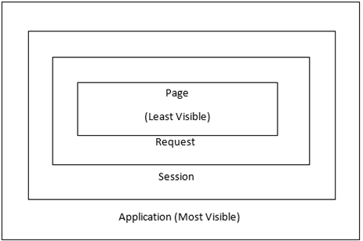

# JSP Implicit Objects

There are `9` jsp implicit objects. These objects are created by the web container.
All are available to all the jsp pages.

| Object      | Type                |
|-------------|---------------------|
| out         | JspWriter           |
| request     | HttpServletRequest  |
| response    | HttpServletResponse |
| config      | ServletConfig       |
| application | ServletContext      |
| pageContext | PageContext         |
| session     | HttpSession         |
| page        | Object              |
| exception   | Throwable           |

## 1. out 
For writing any data to the buffer, JSP provides an implicit object named out.
```html
<html lang="en">  
<body>  
   <% out.print("Today is:"+java.util.Calendar.getInstance().getTime()); %>  
</body>  
</html>   
```
## 2. request

```html
<%   
String name=request.getParameter("uname");  
out.print("welcome "+name);  
%>  
```

## 3. response
In JSP, response is an implicit object of type HttpServletResponse. 
The web container creates the instance of HttpServletResponse for each jsp request.
It can be used to add or manipulate response such as redirect response to another resource,
send error, etc.

```html
<%
response.sendRedirect("https://www.google.com");
%>  
```

## 4. config
In JSP, config is an implicit object of type `ServletConfig`. 
This object can be used to get initialization parameter for a particular JSP page. 
The config object is created by the web container for each jsp page.
Generally, it is used to get initialization parameter from the web.xml file.
```xml

<web-app>

    <servlet>
        <servlet-name>HelloServlet</servlet-name>
        <jsp-file>/general.jsp</jsp-file>

        <init-param>
            <param-name>driverName</param-name>
            <param-value>sun.jdbc.odbc.JdbcOdbcDriver</param-value>
        </init-param>
        <init-param>
            <param-name>author</param-name>
            <param-value>Muhammad Ali</param-value>
        </init-param>

    </servlet>

    <servlet-mapping>
        <servlet-name>HelloServlet</servlet-name>
        <url-pattern>/hello</url-pattern>
    </servlet-mapping>

</web-app>  
```
And to access those initParameters, you can get them from `ServletConfig` object like below:
```jsp
<%
out.println("Welcome: " + config.getInitParameter("author"));

String driver = config.getInitParameter("driverName");
out.println("driver name is = " + driver);
%>  
```


## 5. application
In JSP, application is an implicit object of type `ServletContext`.
The instance of `ServletContext` is created only once by the web container
when an application or project is deployed on the server.
This object can be used to get initialization parameter from configuration file (web.xml). 
It can also be used to get, set or remove attribute from the application scope.
> web.xml
```xml
<web-app>

  <context-param>
    <param-name>vendor</param-name>
    <param-value>tribune.org</param-value>
  </context-param>

</web-app>  
```
> test.jsp
```jsp
<%

String vendor = application.getInitParameter("vendor");
out.print("vendor is " + vendor);

%>  
```

All jsp pages can use this initialization parameter.
## 6. session
We can use this object to retrieve session information 
or to set, get or remove attribute for the current session.  
### Example: passing data between JSPs via session
> first_page.jsp
```html
<html lang="en">  
<body>
<%
String name = request.getParameter("username");
out.print(name);
session.setAttribute("name", name);
%>
<a href="second_page.jsp">second jsp page</a> 
</body>  
</html>  
```
> second_page.jsp
```html

<html lang="en">  
<body>
<%
Enumeration<String> names = session.getAttributeNames();

    while (names.hasMoreElements()) {
    String element = names.nextElement();
    out.print(element + ": " + session.getAttribute(element));
    }

    %>
</body>  
</html>  
```

## 7. pageContext
This object stores references to the request and response objects for each request. 
The `application`, `config`, `session`, and `out` objects are derived by accessing
attributes of this object.  
The `pageContext` object can be used to set, get or remove attribute from one of
the following scopes:
- `page`: (this is the default) the named reference remains available 
  in this PageContext until the return from the current Servlet.service() invocation.
  Objects can be accessed only within the JSP page in which they are referenced.
- `request`: the named reference remains available from the ServletRequest 
  associated with the Servlet until the current request is completed.
  Objects can be accessed within all the pages that serve the current request. 
  These include pages that are forwarded to, and included in, the original JSP page
  to which the request was routed.
- `session`: (only valid if this page participates in a session): 
  the named reference remains available from the HttpSession (if any) 
  associated with the Servlet until the HttpSession is invalidated.  
  Objects can only be accessed within the JSP pages accessed within 
  the session for which the objects are defined.
- `application`: named reference remains available in the ServletContext until it is reclaimed.  
  All JSP pages can access application scope objects in a given context.


## 8. page
`page` is an implicit object. This object is assigned to the
 auto-generated servlet class of the current JSP file.  
For using this object, it must be cast to a `Servlet` type.  
For example:
```html
<% (HttpServlet)page.log("message"); %>
```
or we can just do this
```html
<% this.log("message"); %>
```

## 9. exception
In JSP, exception is an implicit object of type java.lang.Throwable class. This object can be used to print the exception.
```html
<%@ page isErrorPage="true" %>
<html lang="en">
<body>

Sorry, the following exception occurred:<%= exception %>

</body>
</html>  
```
	
	
	
	
	
	
	
	
	